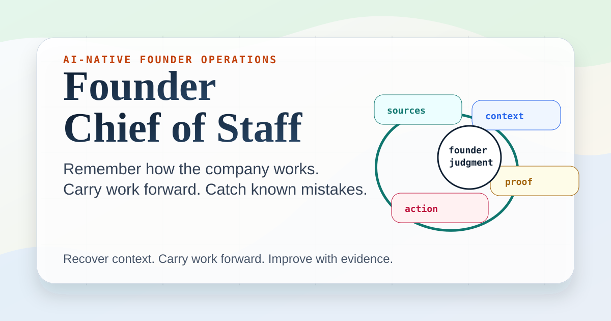

# Founder Chief of Staff

An open-source operating system that turns a general AI agent into a durable Chief of Staff for an early-stage founder.

It keeps the company's state current, prepares decisions, coordinates daily execution, and improves its own operating controls. The founder keeps judgment. The agent owns the system work around that judgment.



## What Is Shipped

This repository contains a working workspace generator, state and automation contracts, Codex and Claude Code entry points, synthetic end-to-end examples, deterministic positive and negative evals, and a one-command release audit.

It does not contain a hosted agent or private founder data. The agent runtime comes from the tool you point at the generated workspace.

```bash
python3 scripts/release_audit.py
```

[See exactly what is runnable, agent-dependent, and private](docs/PROOF_OF_OPERATION.md).

## What It Does

Most AI assistants answer the prompt in front of them. This system also reconciles what changed across the founder's work.

```text
messy update
-> canonical state
-> affected decisions and commitments
-> ranked execution
-> verified system update
```

It supports six connected jobs:

1. **Company memory:** current facts, decisions, evidence, owners, dates, and open questions live in named sources of truth rather than chat history.
2. **Decision preparation:** research and founder updates become options, evidence gaps, and explicit decisions without taking judgment away from the founder.
3. **Capability intelligence:** direct competitors and adjacent companies are decomposed into problems, workflows, and capabilities that can inform a product roadmap.
4. **Relationship operations:** free-text captures become deduplicated people, organization, opportunity, interaction, and introduction records.
5. **Daily execution:** CRM suggestions, strategic commitments, waiting items, and carryovers become a short morning plan.
6. **Continuous improvement:** corrections and failed checks are classified, repaired at the right level, tested, and tracked through a proof window.

This is not a promise of perfect memory or zero mistakes. Chat memory is never treated as authority. Material claims route to canonical sources; contradictions stop closure; repeated failures must produce an enforceable control and verification.

## Start Here

- [PRD.md](PRD.md) explains the product and the founder-agent contract.
- [TECHNICAL.md](TECHNICAL.md) explains the state, routing, automation, and verification architecture.
- [AGENTS.md](AGENTS.md) is the native entry point for Codex and compatible agents.
- [CLAUDE.md](CLAUDE.md) is the native entry point for Claude Code.
- [PROMPT.md](PROMPT.md) is the portable agent specification for Hermes and other agents.
- [docs/OPERATING_CONTROL_MAP.md](docs/OPERATING_CONTROL_MAP.md) tells the agent which artifact owns each job.
- [docs/MEMORY_AND_SYNTHESIS.md](docs/MEMORY_AND_SYNTHESIS.md) explains canonical memory, evidence handling, and capability intelligence.
- [docs/RELATIONSHIP_AND_EXECUTION_STACK.md](docs/RELATIONSHIP_AND_EXECUTION_STACK.md) explains CRM, task planning, and one-way handoffs.
- [docs/CONTINUOUS_IMPROVEMENT_LOOP.md](docs/CONTINUOUS_IMPROVEMENT_LOOP.md) explains how corrections become tested structural controls.
- [docs/PROOF_OF_OPERATION.md](docs/PROOF_OF_OPERATION.md) maps each major claim to runnable, synthetic, or agent-dependent evidence.
- [docs/AUTOMATION_CONTRACTS.md](docs/AUTOMATION_CONTRACTS.md) defines safe recurring work.
- [Live landing page](https://sukrit-bit.github.io/founder-chief-of-staff/) is the public front door.

## Product Decisions

### The workspace, not the chat, carries state

The agent may use conversation context to reason, but it must verify material facts against named sources of truth. A small state registry records what is authoritative, what is read-only, and what is historical.

### State is routed, not duplicated

The dashboard owns current focus. Working state owns continuity. The decision queue owns unresolved judgment. CRM owns relationships and opportunities. The task console owns the founder's execution view. An operating control map prevents one giant memory document from carrying every job.

### Research must change a decision or remain evidence

A company case is not automatically a product recommendation. The synthesis layer extracts the problem, user, workflow, capability, proof, and limitation, then routes the learning to a build, integrate, bundle, compete, monitor, or reject decision.

### The agent maintains the system

When a material update arrives, the agent should reconcile every affected canonical surface. Low-risk internal maintenance can be automatic. External publication, sensitive data, irreversible actions, and unsupported strategic calls remain human-gated.

### Corrections require structural remedies

Changing one answer or one priority is not enough when the underlying failure can recur. The system classifies the failure, inspects its blast radius, changes the controlling rule or code, runs a positive test and a negative test, and keeps the remedy under observation.

### Strategy and execution stay connected but separate

The CRM can suggest tasks to the founder's daily console. The console does not rewrite CRM truth. A coding agent can receive a narrow implementation handoff. It does not need the entire founder workspace.

## Architecture

```text
00_Context/
  Current_Decision_Dashboard.md
  Current_Working_State.md
  Project_Artifact_Index.md
  Operating_Control_Map.md
  State_Registry.json

01_Themes/                 market and capability synthesis
03_Problem_Statements/     defined user and workflow problems
04_Venture_Theses/         product and business hypotheses
05_Experiments/            tests, pilots, and evidence
06_Decision_Log/           active decisions and reviews
07_Source_Material/        source notes and company cases
08_Execution/              relationship and personal execution views
09_Automation/             contracts, controls, checks, and proof
templates/                 reusable artifact formats
```

The architecture is file-native so it remains inspectable, portable, and usable by different agents. Sheets or databases can own live CRM and task data; the registry and control map record those boundaries.

## Install

```bash
git clone https://github.com/Sukrit-bit/founder-chief-of-staff.git
cd founder-chief-of-staff
python3 scripts/init_workspace.py ~/founder-workspace/my-company
```

Then point your agent at the generated workspace:

```text
Codex: read AGENTS.md
Claude Code: read CLAUDE.md
Other agents: read PROMPT.md
```

Run the checks:

```bash
python3 scripts/release_audit.py
```

## Daily Rhythm

A useful default is three bounded runs:

1. **Relationship triage:** process eligible free-text captures into canonical CRM records.
2. **Founder planning:** reconcile new commitments, import CRM suggestions without writeback, and produce a ranked daily plan.
3. **Control scan:** check stale state, broken references, contradictory claims, automation drift, and open proof windows.

Each run needs an automation contract with eligible inputs, allowed writes, inference limits, stop conditions, verification, and a no-change reporting rule.

## Safe By Default

The repository contains synthetic examples only. Do not publish client work, credentials, personal notes, private company strategy, or live relationship data.

The included safety check catches common leaks. It does not replace judgment or access controls.

## Results

This repository is not a prompt pack. It is an inspectable operating harness:

- canonical state instead of chat-only memory;
- explicit ownership and routing instead of one large context file;
- evidence-backed synthesis instead of competitor summaries;
- CRM-to-task handoffs instead of disconnected trackers;
- bounded automations instead of broad agent access;
- tested remedies instead of a failure log that nobody enforces.

The public founder-event eval includes both a plan that must pass and a plan that must be blocked for incomplete routing, an invented deadline, an unsupported rejection, and unapproved outreach.

See [CHANGELOG.md](CHANGELOG.md) for the current release history.

## Built With

This framework was developed through sustained founder-agent collaboration. Codex helped maintain the operating system and implementation; the founder supplied judgment, corrections, risk boundaries, and real operating pressure.

Style check: external style applied.
